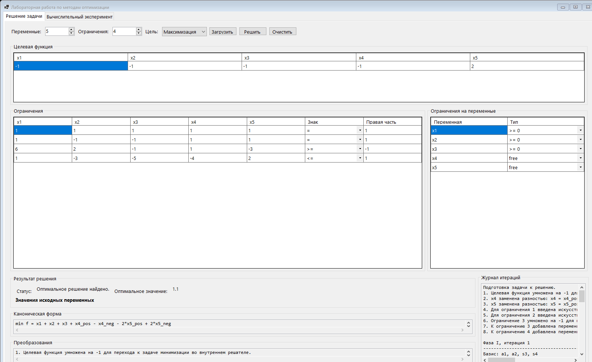

# Руководство пользователя по интерфейсу OptimizationLabApp

## Для чего нужна программа

`OptimizationLabApp` — это настольное приложение для решения задач линейного программирования симплекс-методом.

С помощью программы можно:

- ввести свою задачу линейного программирования вручную;
- выбрать число переменных и ограничений;
- указать тип целевой функции: максимизация или минимизация;
- задать ограничения вида `<=`, `=` и `>=`;
- указать, какие переменные неотрицательны, а какие свободны (`free`);
- получить оптимальное решение;
- посмотреть каноническую форму задачи;
- увидеть, какие преобразования были выполнены программой;
- просмотреть журнал итераций симплекс-метода;
- провести вычислительный эксперимент и оценить устойчивость решения к возмущениям правых частей.

---

## Как выглядит главное окно

Ниже показан основной экран программы:

Главное окно состоит из двух вкладок:

1. `Решение задачи`
2. `Вычислительный эксперимент`

Если вы впервые открыли программу, почти всегда начинать нужно с вкладки `Решение задачи`.

---

## Быстрый старт: куда нажимать в первый раз

Если вы хотите просто увидеть, как программа работает на готовом примере, делайте так:

1. Откройте вкладку `Решение задачи`.
2. Нажмите кнопку `Загрузить пример`.
3. Убедитесь, что таблицы заполнились автоматически.
4. Нажмите кнопку `Решить задачу`.
5. Посмотрите блок `Результат решения`.
6. Ниже изучите блоки `Каноническая форма`, `Преобразования` и `Журнал итераций`.
7. Если хотите посмотреть эксперимент устойчивости, перейдите на вкладку `Вычислительный эксперимент`.
8. Нажмите `Запустить эксперимент`.
9. Посмотрите графики и сводную таблицу справа.

Это самый простой сценарий для первого знакомства.

---

## Вкладка «Решение задачи»

Это основная рабочая вкладка. На ней вы:

- задаёте структуру задачи;
- вводите коэффициенты;
- запускаете решение;
- смотрите итог и подробности вычислений.

### Верхняя панель управления

В верхней части окна находятся поля и кнопки быстрого управления.

#### Поле `Переменные`

Это числовое поле показывает, сколько переменных будет в задаче.

Как использовать:

1. Нажмите на стрелку вверх, если хотите увеличить число переменных.
2. Нажмите на стрелку вниз, если хотите уменьшить число переменных.
3. После изменения этого числа программа автоматически перестраивает таблицы ниже.

Что важно понимать:

- если было `5`, то в таблицах будут столбцы `x1`, `x2`, `x3`, `x4`, `x5`;
- если поставить `6`, появится ещё один столбец `x6`;
- если уменьшить число переменных, лишние столбцы исчезнут.

Когда это использовать:

- когда вы вводите свою задачу с нуля;
- когда пример из программы не подходит и нужно задать другую размерность.

#### Поле `Ограничения`

Это числовое поле показывает, сколько ограничений будет в задаче.

Как использовать:

1. Увеличьте число, если у вас больше строк ограничений.
2. Уменьшите число, если ограничений меньше.
3. После изменения таблица ограничений автоматически перестроится.

Что меняется:

- каждое ограничение — это одна строка в таблице `Ограничения`;
- если увеличить число, добавятся новые пустые строки;
- если уменьшить число, лишние строки будут удалены.

#### Поле `Цель`

Это выпадающий список, где выбирается тип задачи:

- `Максимизация`
- `Минимизация`

Когда что выбирать:

- выбирайте `Максимизация`, если целевая функция должна быть максимальной;
- выбирайте `Минимизация`, если ищете минимум.

Если у вас в условии написано `F(x) -> max`, выбирайте `Максимизация`.

#### Кнопка `Загрузить пример`

Эта кнопка автоматически подставляет в таблицы встроенную демонстрационную задачу.

Что происходит после нажатия:

- программа выставляет нужное число переменных и ограничений;
- заполняет целевую функцию;
- заполняет коэффициенты ограничений;
- выставляет знаки ограничений;
- задаёт типы переменных.

Когда нажимать:

- если хотите быстро проверить работу программы;
- если хотите использовать встроенный пример как шаблон;
- если случайно испортили таблицы и хотите вернуть рабочий вариант.

#### Кнопка `Решить задачу`

Это главная кнопка на вкладке.

После нажатия программа:

1. считывает все введённые данные;
2. проверяет, можно ли их интерпретировать как числа;
3. строит внутреннюю математическую модель;
4. приводит задачу к каноническому виду;
5. запускает двухфазный симплекс-метод;
6. показывает результат решения;
7. выводит журнал итераций.

Нажимайте её после того, как:

- выбрали число переменных и ограничений;
- заполнили таблицу целевой функции;
- заполнили все ограничения;
- указали типы переменных.

#### Кнопка `Очистить вывод`

Эта кнопка очищает только результаты работы программы, но не удаляет введённые коэффициенты из таблиц.

Что очищается:

- статус решения;
- найденное значение целевой функции;
- таблица оптимальных значений переменных;
- каноническая форма;
- список преобразований;
- журнал итераций;
- графики и таблица эксперимента.

Когда полезна:

- если вы хотите убрать старый результат перед новым запуском;
- если вы меняете задачу и не хотите путаться со старыми данными;
- если нужно начать анализ заново, не переписывая входные коэффициенты.

---

## Блок «Целевая функция»

Этот блок находится в верхней части основной вкладки.

Что в нём видно:

- одна строка;
- несколько столбцов `x1`, `x2`, `x3` и так далее.

Как заполнять:

- в столбце `x1` вводится коэффициент при переменной `x1`;
- в столбце `x2` — коэффициент при `x2`;
- и так далее.

Пример:

Если у вас функция

`F(x) = 2x1 - 3x2 + 5x3`,

то в строке нужно ввести:

- в `x1` число `2`
- в `x2` число `-3`
- в `x3` число `5`

Если переменных больше, остальные коэффициенты тоже заполняются.

Если коэффициент равен нулю:

- можно ввести `0`;
- можно оставить поле пустым, программа воспримет пустое поле как `0`.

---

## Блок «Ограничения»

Это самая большая таблица на вкладке `Решение задачи`.

Каждая строка таблицы — одно ограничение.

### Что находится в каждой строке

В строке есть:

- коэффициенты при `x1`, `x2`, `x3`, ...;
- столбец `Знак`;
- столбец `Правая часть`.

### Как заполнять одну строку ограничения

Допустим, у вас ограничение:

`3x1 - x2 + 4x3 <= 7`

Тогда нужно ввести:

- в `x1` число `3`;
- в `x2` число `-1`;
- в `x3` число `4`;
- в столбце `Знак` выбрать `<=`;
- в столбце `Правая часть` ввести `7`.

### Столбец `Знак`

Это выпадающий список. Для каждой строки можно выбрать один из трёх вариантов:

- `<=`
- `=`
- `>=`

Использование:

- выбирайте `<=`, если ограничение вида «меньше либо равно»;
- выбирайте `=`, если это точное равенство;
- выбирайте `>=`, если ограничение вида «больше либо равно».

### Столбец `Правая часть`

Здесь задаётся число в правой части ограничения.

Примеры:

- для `x1 + x2 <= 10` сюда вводится `10`;
- для `2x1 - 5x2 = -3` сюда вводится `-3`;
- для `x1 + x3 >= 1.5` сюда вводится `1.5`.

---

## Блок «Ограничения на переменные»

Этот блок расположен справа от таблицы ограничений.

Здесь каждая строка соответствует одной переменной.

Например:

- строка `x1` — это свойства переменной `x1`;
- строка `x2` — свойства переменной `x2`;
- и так далее.

### Столбец `Тип`

Для каждой переменной можно выбрать одно из двух состояний:

- `>= 0`
- `free`

#### Вариант `>= 0`

Означает, что переменная неотрицательна:

`x_i >= 0`

Это стандартный случай для задач линейного программирования.

#### Вариант `free`

Означает, что переменная свободная, то есть может принимать и положительные, и отрицательные значения.

Что делает программа с такой переменной:

- автоматически заменяет её на разность двух неотрицательных переменных;
- отражает это в блоке `Преобразования`;
- учитывает это в канонической форме.

Когда выбирать `free`:

- если по условию переменная не ограничена снизу нулём;
- если в постановке задачи явно написано, что переменная свободна.

---

## Блок «Результат решения»

Этот блок появляется в нижней левой части окна после нажатия `Решить задачу`.

### Поле `Статус`

Показывает, что произошло после запуска расчёта.

Возможные варианты:

- задача решена успешно;
- задача неограничена;
- допустимое решение не найдено;
- программа обнаружила ошибку ввода.

На что смотреть в первую очередь:

1. сначала на `Статус`;
2. потом на `Оптимальное значение`;
3. затем на таблицу значений переменных.

### Поле `Оптимальное значение`

Здесь отображается итоговое значение целевой функции.

Если задача решена успешно, вы увидите число.

Если решение не найдено, вместо числа будет:

- `н/д`

### Таблица `Значения исходных переменных`

В этой таблице выводятся уже восстановленные значения исходных переменных задачи:

- `x1`
- `x2`
- `x3`
- и так далее

Важно:

- даже если внутри программы свободная переменная была заменена двумя вспомогательными переменными, в этом блоке вы увидите именно исходную переменную;
- это итог, который обычно и требуется в отчёте или в ответе к задаче.

---

## Блок «Каноническая форма»

Этот блок находится под результатом решения.

Что в нём показывается:

- внутренняя каноническая форма задачи, которую реально решает программа;
- уже после всех преобразований.

Зачем он нужен:

- чтобы увидеть, как программа переписала исходную задачу;
- чтобы понять, какие переменные были добавлены;
- чтобы проследить переход к стандартной форме симплекс-метода.

Когда особенно полезен:

- если вы изучаете метод и хотите понять внутренние шаги;
- если проверяете корректность ввода свободных переменных и неравенств;
- если нужно вставить преобразованную задачу в отчёт.

---

## Блок «Преобразования»

Этот блок расположен ниже канонической формы.

Он показывает список действий, которые программа выполнила автоматически.

Примеры записей в этом блоке:

- целевая функция умножена на `-1` для перехода к внутренней задаче минимизации;
- свободная переменная заменена разностью двух неотрицательных;
- введена переменная запаса;
- введена переменная избытка;
- введена искусственная переменная;
- строка ограничения умножена на `-1`, чтобы сделать правую часть неотрицательной.

Зачем нужен этот блок:

- для обучения;
- для проверки правильности преобразований;
- для отчёта, если нужно описать, как задача приводилась к каноническому виду.

---

## Блок «Журнал итераций»

Этот блок находится справа внизу.

Это подробный лог работы двухфазного симплекс-метода.

Что там можно увидеть:

- начало решения;
- фазу I и фазу II;
- текущий базис;
- значения базисных переменных;
- оценки;
- входящую переменную;
- выходящую переменную;
- переходы между итерациями;
- сообщение о нахождении оптимума.

Когда его читать:

- если нужно понять, как программа пришла к результату;
- если вы изучаете симплекс-метод;
- если хотите проверить, на каком шаге возникает проблема;
- если преподаватель просит показать ход вычислений, а не только финальный ответ.

---

## Вкладка «Вычислительный эксперимент»

На эту вкладку переходят после того, как нужно исследовать устойчивость решения.

Здесь программа автоматически изменяет правые части ограничений и смотрит, как меняется результат.

### Верхняя панель этой вкладки

На панели находятся следующие поля:

#### Поле `Прогонов на диапазон`

Показывает, сколько раз программа будет решать задачу для каждого значения ошибки.

Пример:

Если стоит `45`, то для каждого диапазона возмущения программа выполнит 45 запусков.

Если увеличить число:

- результат будет статистически стабильнее;
- эксперимент будет выполняться дольше.

Если уменьшить число:

- эксперимент завершится быстрее;
- статистика будет грубее.

#### Поле `Минимальная степень 10`

Задаёт нижнюю границу диапазона ошибок в виде степени числа 10.

Например:

- `-5` означает ошибку порядка `10^-5`.

#### Поле `Максимальная степень 10`

Задаёт верхнюю границу диапазона ошибок.

Например:

- `-1` означает ошибку порядка `10^-1`.

Если выставить:

- минимум `-5`
- максимум `-1`

то программа исследует диапазон от очень малых до сравнительно больших возмущений.

#### Поле `Seed`

Это начальное значение генератора случайных чисел.

Зачем оно нужно:

- чтобы эксперимент можно было воспроизвести;
- если использовать один и тот же `Seed`, программа будет генерировать одну и ту же последовательность случайных возмущений.

Когда менять:

- если хотите получить другой набор случайных тестов;
- если преподаватель или отчёт требует повторяемого эксперимента, оставляйте одно и то же значение.

#### Кнопка `Запустить эксперимент`

Эта кнопка запускает серию решений задачи с возмущёнными правыми частями.

Что делает программа после нажатия:

1. берёт текущую задачу из вкладки `Решение задачи`;
2. решает её как базовую;
3. по очереди создаёт возмущённые версии задачи;
4. считает абсолютные и относительные ошибки;
5. строит графики;
6. заполняет сводную таблицу.

Важно:

- эксперимент использует те данные, которые сейчас введены в основной задаче;
- если на вкладке `Решение задачи` введены неправильные данные, эксперимент тоже будет некорректным.

---

## Что находится на вкладке «Вычислительный эксперимент»

### График `Средняя абсолютная погрешность`

Показывает, как меняется средняя абсолютная ошибка при разных уровнях возмущения.

Чем выше график:

- тем сильнее отклонение результата от базового решения.

### График `Средняя относительная погрешность`

Показывает относительную ошибку, то есть ошибку по отношению к величине базового результата.

Зачем он нужен:

- чтобы понять не только абсолютное отклонение, но и масштаб ошибки в относительных единицах.

### Поле `Статус`

Показывает, завершился ли эксперимент успешно.

### Поле `Базовое значение целевой функции`

Это значение целевой функции для исходной задачи без возмущений.

С ним сравниваются результаты всех случайных запусков.

### Таблица `Сводная таблица эксперимента`

В таблице выводятся:

- диапазон ошибки;
- средняя абсолютная ошибка;
- стандартное отклонение абсолютной ошибки;
- средняя относительная ошибка;
- стандартное отклонение относительной ошибки;
- число успешных прогонов.

Как её читать:

- `Диапазон ошибки` — величина возмущения;
- `Средняя абсолютная` — среднее отклонение результата;
- `СКО абсолютной` — разброс абсолютной ошибки;
- `Средняя относительная` — ошибка в долях от базового значения;
- `СКО относительной` — разброс относительной ошибки;
- `Успешных прогонов` — сколько запусков завершилось корректно.

---

## Подробный сценарий 1: решить встроенный пример

Если вы хотите просто получить готовый ответ на демонстрационной задаче:

1. Запустите программу.
2. Откройте вкладку `Решение задачи`.
3. Нажмите `Загрузить пример`.
4. Проверьте, что:
   - число переменных стало `5`;
   - число ограничений стало `4`;
   - таблицы автоматически заполнились.
5. Нажмите `Решить задачу`.
6. Прочитайте `Статус`.
7. Посмотрите `Оптимальное значение`.
8. Ниже посмотрите таблицу исходных переменных.
9. Если нужно понять внутреннюю механику, прочитайте `Каноническая форма`.
10. Затем откройте `Преобразования`.
11. Если нужен полный ход решения, изучите `Журнал итераций`.

---

## Подробный сценарий 2: ввести свою задачу с нуля

Если вы хотите решить собственную задачу:

1. Перейдите на вкладку `Решение задачи`.
2. При необходимости нажмите `Очистить вывод`.
3. В поле `Переменные` установите нужное число переменных.
4. В поле `Ограничения` установите нужное число ограничений.
5. В списке `Цель` выберите `Максимизация` или `Минимизация`.
6. В блоке `Целевая функция` введите коэффициенты.
7. В блоке `Ограничения` заполните каждую строку:
   - коэффициенты при переменных;
   - знак ограничения;
   - правую часть.
8. В блоке `Ограничения на переменные` укажите для каждой переменной:
   - `>= 0`, если переменная неотрицательная;
   - `free`, если переменная свободная.
9. После заполнения таблиц нажмите `Решить задачу`.
10. Проверьте `Статус`.
11. Если решение найдено, используйте таблицу результатов и каноническую форму.

---

## Подробный сценарий 3: провести эксперимент устойчивости

После того как задача введена:

1. Убедитесь, что данные на вкладке `Решение задачи` верны.
2. При желании сначала нажмите `Решить задачу`, чтобы посмотреть базовое решение.
3. Перейдите на вкладку `Вычислительный эксперимент`.
4. Установите `Прогонов на диапазон`.
5. Выберите `Минимальная степень 10`.
6. Выберите `Максимальная степень 10`.
7. При необходимости измените `Seed`.
8. Нажмите `Запустить эксперимент`.
9. Дождитесь завершения расчёта.
10. Сначала посмотрите `Статус`.
11. Затем посмотрите `Базовое значение целевой функции`.
12. Изучите графики.
13. Справа прочитайте численные значения в таблице.

---

## Что делать, если программа сообщает об ошибке

Если программа не может решить задачу или пишет, что вход некорректен, проверьте следующее:

### 1. Все ли коэффициенты введены правильно

Проверьте:

- не перепутан ли знак коэффициента;
- нет ли пропущенных значений;
- нет ли случайно введённого текста вместо числа.

### 2. Правильно ли выбраны знаки ограничений

Частая ошибка:

- в условии стоит `>=`, а в таблице выбрано `<=`.

### 3. Правильно ли указаны типы переменных

Если переменная должна быть свободной, а вы оставили `>= 0`, результат может оказаться неверным.

### 4. Не противоречат ли ограничения друг другу

Если система ограничений несовместна, программа не сможет найти допустимое решение.

### 5. Не неограничена ли задача

Если задача допускает бесконечное улучшение целевой функции, программа сообщит, что задача неограничена.

---

## Полезные замечания по вводу данных

### Можно ли использовать отрицательные числа

Да, можно.

Отрицательными могут быть:

- коэффициенты целевой функции;
- коэффициенты ограничений;
- правые части ограничений.

### Можно ли использовать десятичные дроби

Да.

Обычно безопасно вводить:

- `1.5`
- `-0.25`
- `3`

Если в системе используется десятичная запятая, программа часто тоже распознаёт такой ввод, но самый надёжный вариант — использовать точку.

### Что будет, если оставить поле пустым

Пустые ячейки программа интерпретирует как `0`.

### Нужно ли каждый раз заново вводить всё после решения

Нет.

Вы можете:

- изменить только одну строку;
- поменять только правую часть;
- исправить только знак;
- снова нажать `Решить задачу`.

---

## Как использовать эту инструкцию вместе с программой

Рекомендуемый порядок такой:

1. Откройте программу.
2. Откройте этот файл `UI_GUIDE.md`.
3. Двигайтесь сверху вниз:
   - сначала верхняя панель;
   - потом целевая функция;
   - потом ограничения;
   - потом типы переменных;
   - потом запуск решения;
   - потом анализ результата;
   - затем эксперимент.

Если вы показываете программу другому человеку впервые, лучше всего использовать сценарий:

1. `Загрузить пример`
2. `Решить задачу`
3. показать результат
4. показать каноническую форму
5. показать журнал итераций
6. перейти на вкладку эксперимента
7. `Запустить эксперимент`

---

## Краткая памятка в одном списке

Если совсем коротко:

1. `Переменные` — сколько столбцов `x1, x2, ...` будет в задаче.
2. `Ограничения` — сколько строк ограничений будет в таблице.
3. `Цель` — выбрать максимум или минимум.
4. `Загрузить пример` — автоматически подставить готовую задачу.
5. `Целевая функция` — ввести коэффициенты функции.
6. `Ограничения` — ввести матрицу, знак и правые части.
7. `Ограничения на переменные` — выбрать `>= 0` или `free`.
8. `Решить задачу` — запустить симплекс-метод.
9. `Результат решения` — смотреть ответ.
10. `Каноническая форма` — смотреть преобразованную задачу.
11. `Преобразования` — смотреть, что именно изменила программа.
12. `Журнал итераций` — смотреть ход алгоритма.
13. `Вычислительный эксперимент` — вкладка для анализа устойчивости.
14. `Запустить эксперимент` — рассчитать ошибки и построить графики.

---

## Где лежит этот файл

Этот файл находится рядом с проектом:

`OptimizationLabApp/UI_GUIDE.md`

Если нужно, на его основе можно сделать отдельную PDF-инструкцию или включить этот текст в отчёт.
